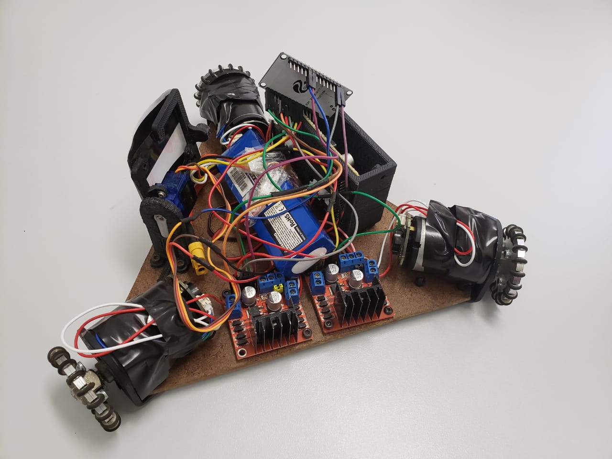
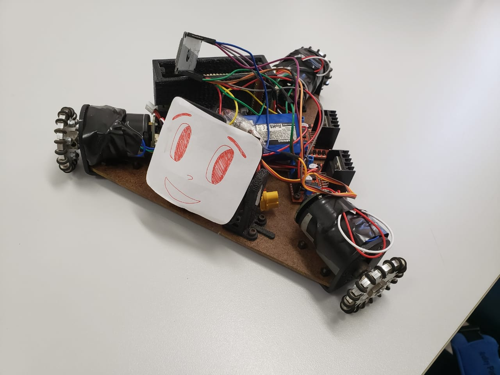
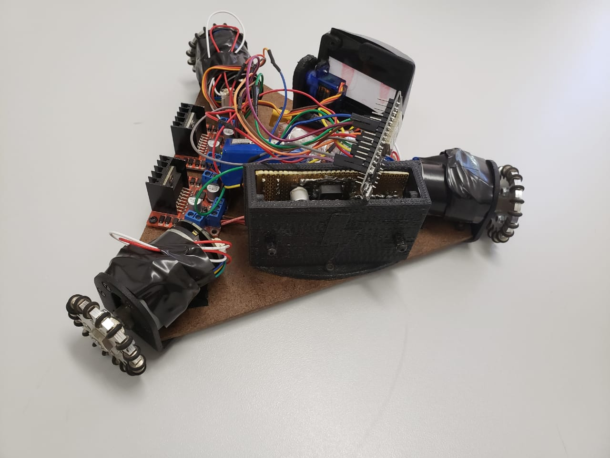
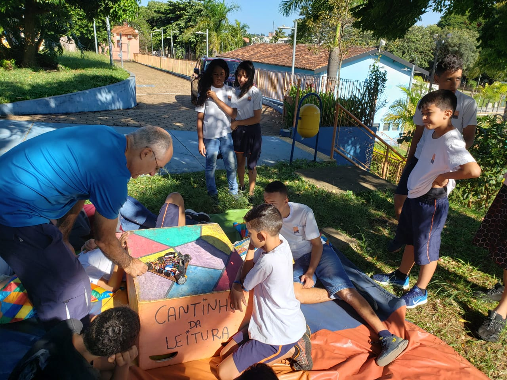
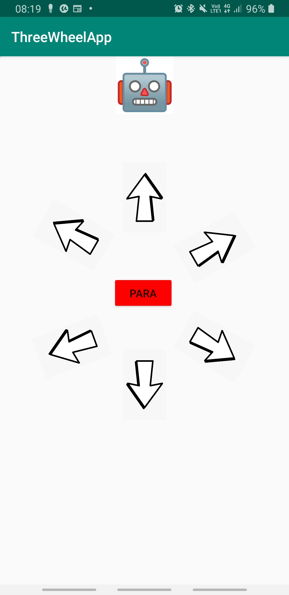

# Robô educacional de três rodas

Este robô foi feito para ser utilizado no Projeto Pequeno Cidadão (USP) para ensinar um grupo de crianças sobre movimentação holonômica. Ou seja, como um robô com três rodas de rodinhas consegue se mover para qualquer direção. (Este robô é um protótipo feito em poucas horas).

**Videos:**
- [Teste de mesa](https://youtu.be/69XSIkj_g4I)
- [Brincadeira com as crianças](https://youtu.be/moCg1Qu2aBo)

## ESP32
O programa foi desenvolvido no Platformio se baseando neste código [aqui](https://gitlab.com/simoesusp/ESP32_Projects/-/tree/master/RobotControlAndroidSonar). Basicamente o Esp32 cria uma rede de wifi. Após se conectar ao encontrar em um dos links pré-definidos o robô executa a respectiva função.

Os comandos são:
- `/servo`
- `/stop`
- `/ligaled`
- `/desligaled`
- `/move1`
- `/move2`
- `/move3`
- `/move4`
- `/move5`
- `/move6`

Na programação do Esp32 é possível mudar o comportamento do robô ao receber cada comando.

## Aplicativo
O aplicativo foi feito no Android Studio. Basicamente após o usuário se conectar na rede do robô (`OmniRobo`) o aplicativo entra em links específicos ao apertar os botões para falar para o robô o que ele deve fazer.
No aplicativo é possível mover a cabeça do robô e controlar a direção do movimento.

### Agradecimentos
Agradecimentos espaciais a Lucas Romero, Maria Eduarda Kawakami, Otto Fernandes. Este robô foi baseado no [projeto desenvolvido por eles](https://github.com/ottusp/Eletronica_Arduino). Boa parte do código do Esp32 foi baseado [neste aqui](https://gitlab.com/simoesusp/ESP32_Projects/-/tree/master/RobotControlAndroidSonar).
